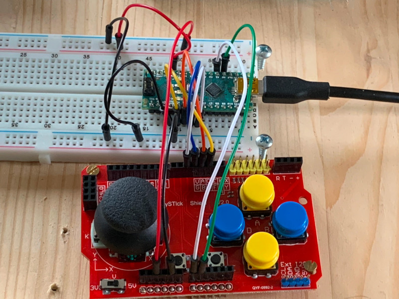
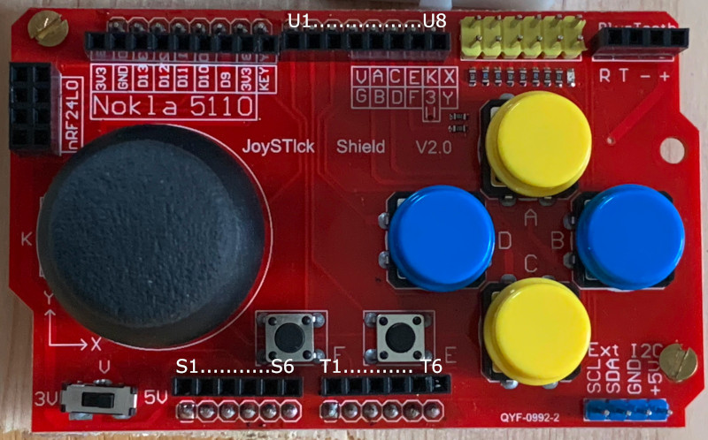

`az-joystickshield-on-avr`
==================

This is a serial interface server for reading input from the [AZ Delivery PS2 Joystick Shield Game Pad Keypad V2.0](https://www.az-delivery.de/products/azdelivery-joystick-ky-023-keypad-gamepad-shield-ps2-fur-arduino-uno-r3-mega2560-leonardo-duemilanove) via an AVR based MCU (so far tested on Arduino Nano, but other Arduino platforms should be fairly easy).



## Features

* mini-server running on Arduino, serving the host via RX/TX (RS-232 USART built into Arduino)
* accepts commands from host for configuration and requesting data
* text format for debugging (default) and binary format for fast and compact data transmission
* multple transmission modes:
  - on-event (default): Sends data when something changed
  - on-request: Sends data only when requested by host
  - continuous: Sends data always when it becomes available


## Target plaforms

So far this project is tested on **Arduino Nano**. It was started with [avr-hal-template](https://github.com/Rahix/avr-hal-template), and *should* support the following platforms (target configurations exist in the [avr-specs](avr-specs) directory, the currently active one is referenced in [.cargo/Cargo.toml](.cargo/config.toml)):
 - Arduino Leonardo
 - Arduino Mega 2560
 - Arduino Mega 1280
 - Arduino Nano
 - Arduino Nano New Bootloader (Manufactured after January 2018)
 - Arduino Uno
 - SparkFun ProMicro
 - Adafruit Trinket
 - Adafruit Trinket Pro

## Getting Started
Install `ravedude`:

```bash
cargo install ravedude
```

Simply build and run, with your Arduino connected via USB (see below):

```bash
cargo run
```

When started, the server will print a welcome message:

```
# Hello from Serial Monitor for AZ Delivery joystick shield!
```

When there's activity (e.g. press button, noise from joystick), you should see output:
```
...
x:517, y:523, b:0
...
```


## Connecting the shield to the Arduino

The software uses a pinout that should be suitable for most Arduinos. In principle, it uses A0,A1 for the analog stick's X and Y axes, and D2..D5 for the button inputs (configured with internal pull up input).

### Arduino Uno ###
**Not yet tested**

In theory, this should be as easy as plugging the shield directly onto the Arduino Uno, as per the joystick shield's manual.

### Arduino Nano ###

Since the shield was constructed for the Arduino Uno, connecting it to the Nano requires to properly wire it, as the Nano's pinout is not compatible with shields.

Connection is easy though.

You'll also find that there are multiple ways to connect the shild; what's shown here is one of them. Because there's no complete pinout description for the shield (at least I couldn't find one quickly), we'll state the pinout here using this image:



I simply named the relevant connectors S, T and U. S and T offer 6 pin slots, U has 8, from left to right.

| what     | Arduino pin | shield pin |
|----------|-------------|------------|
| VCC      | 5V          |     S3     |
| GND      | GND         |     S5     |
| x axis   | A0          |     T2     |
| y axis   | A1          |     T1     |
| button A | D2          |     U6     |
| button B | D3          |     U5     |
| button C | D4          |     U4     |
| button D | D5          |     U3     |

Note that the board features additional buttons F and E, which I didn't connect, as I didn't need them for now (feel free to suggest)

## Data and Configuration

After initial startup, if there is activity on the shield, the serial monitor will print output as text. 'Activity' means either pressing buttons, moving the stick, or simply receiving the noise that the Arduino's ADCs generate when reading the stick axis (which is the most common reason why activity is detected by the serial monitor).

You can change this behaviour by selecting a different transmission mode. The following modes are available:
* on-event (default): Sends data when something changed
* on-request: Sends data only when requested by host
* continuous: Sends data always when it becomes available

The serial monitor supports two formats:
* text: Data is sent in a `x:<u16>, y:<u16>, b:<u8>` format, where `<u8>` and `<u16>` are 8/16 bit integers printed as decimal numbers.
* binary: Data in a 4 byte binary format, encoding data for quick transmission, taking only about 1/6th of the space of the text format

On startup, the serial monitor is set to output text.

The serial monitor accepts single byte commands for switching form

### Commands

To change configuration like the transmission mode, or to trigger sampling, the serial monitor supports single byte commands. To make it handy, these commands are simply single letters. For instance, to switch to the on-event mode, send the letter `e`. Because most terminals send input only after pressing enter, you may have to press end (sending `\n` effectively after hitting entering `e`). Unknown command bytes (like `\n`) are ignored.

#### Transmission mode switch and sampling trigger

To switch to a different transmission mode, use one of the following commands
| Command | TxMode     |
| ------- | ---------- |
| `e`     | on-event   |
| `r`     | on-request | 
| `c`     | continuous |

When the selected mode is on-request, the receiver needs to manually request a sample:

| Command | Effect                 |
| ------- | ---------------------- |
| `r`     | transmit single sample |


#### Format switch

To choose between formats, use these commands:
| Command | Format |
| ------- | ------ |
| `t`     | Text   |
| `b`     | Binary |


### Text Format

The default format after startup. To switch to this format, send the `t` command

Output may look like this:
```
...
x:517, y:523, b:0
x:516, y:523, b:0
x:517, y:523, b:0
...
```

The values following `x:` and `y:` are the values read from the x and y axes. As the Arduino's ADC reads values from 0..1023, the current values easily indicate that the stick is in the center (in theory this should be exactly 511, but it will always be off because of joystick drift).

`b:` indicates the current button state. This is effectively a bitmask for the four buttons A..D, where A is bit 0, B is bit 1 etc. 

Here are some examples for the value of `b:`

| Button pressed | value printed |
|----------------|---------------|
| none           | 0             |
| A              | 1             |
| B              | 2             |
| C              | 4             |
| D              | 8             |
| A + B          | 3             |
| B + C          | 6             |


### Binary format

The text format is fine for humans, but in order to read the data quickly, a binary format is available. The format consists of *frames*, where each frame is a sample of the complete state of the joystick shield (effectively the same data as is printed in a line in the text format).

A frame consists of four bytes, where only the first byte has it's MSB (bit 7, the most significant bit) set. 

The reason is simple: If, for any reason, communication gets out of sync, the receiver simply has to wait for receiving a byte with bit 7 set to know that they received the start of a frame. Without this, the receiver may miss a byte, and then misinterpret the data (e.g. mistake the y axis value for the button mask).

The following sketch shows how the MSB is set on the first byte of each frame:
```
|               frame 1             |   frame 2
| byte 0 | byte 1 | byte 2 | byte 3 | byte 0 | ...
|76543210|76543210|76543210|76543210|76543210|...
|1.......|0.......|0.......|0.......|1.......|0..
```
Byte 0 contains the button mask:
```
|76543210|
|1000DCBA|
     ^^^^--- bits for buttons A..D
  ^^^------- reserved (ignore)
^----------- frame start bit (always 1)
```

Byte 1 and 2 contain the 7 most significant bits of the value read from the joystick axes. The format for these two bytes is identical, however, byte 1 holds the data for the x asix, byte 2 for the y axis:


```
|76543210|
|0VVVVVVV|
  ^^^^^^^--- 7 most significant bits for axis value
^----------- mid frame bit (always 0)
```

An axis value can range from 0..1023 (which is 10 bits). Since we can only hold up until 7 bits in a frame byte (remember, bit 7 is required as frame start bit), we have to split the an axis value into the 7 most significant bits and 3 least significant bits.

To get the 7 most significant bits, the following pseudo code uses a left bit shift `>>`:
`MSB7 := v10 >> 3`

To get the 3 least significant bits, we simply mask the rest:
`LSB3 := v10 & 0x07`

Bytes 2 and 3 hold the MSB7 values of the x and y axes, respectively. If 7 bits of resolution is enough, the values can be used as-is.

The LSB3s of each axis are encoded in byte 3 of each frame, in the high and low nibbles. 

```
|76543210|
|0YYY0XXX|
      ^^^--- 3 least significant bits for x axis value
     ^------ unused, ignore
  ^^^------- 3 least significant bits for y axis value
 ^---------- mid frame bit (always 0)
```

## License
Licensed under either of

 - Apache License, Version 2.0
   ([LICENSE-APACHE](LICENSE-APACHE) or <http://www.apache.org/licenses/LICENSE-2.0>)
 - MIT license
   ([LICENSE-MIT](LICENSE-MIT) or <http://opensource.org/licenses/MIT>)

at your option.

## Contribution
Unless you explicitly state otherwise, any contribution intentionally submitted
for inclusion in the work by you, as defined in the Apache-2.0 license, shall
be dual licensed as above, without any additional terms or conditions.
